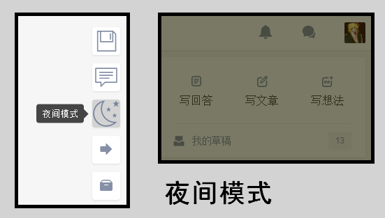
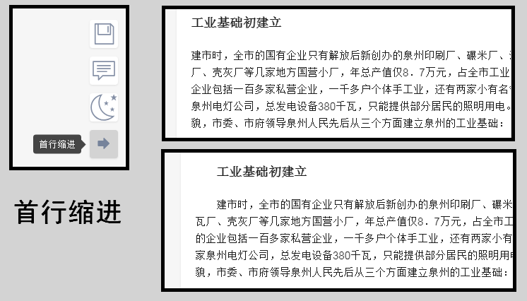
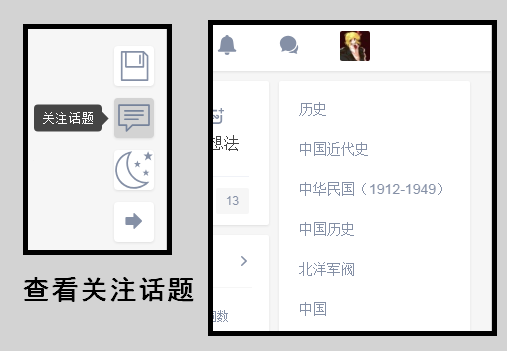
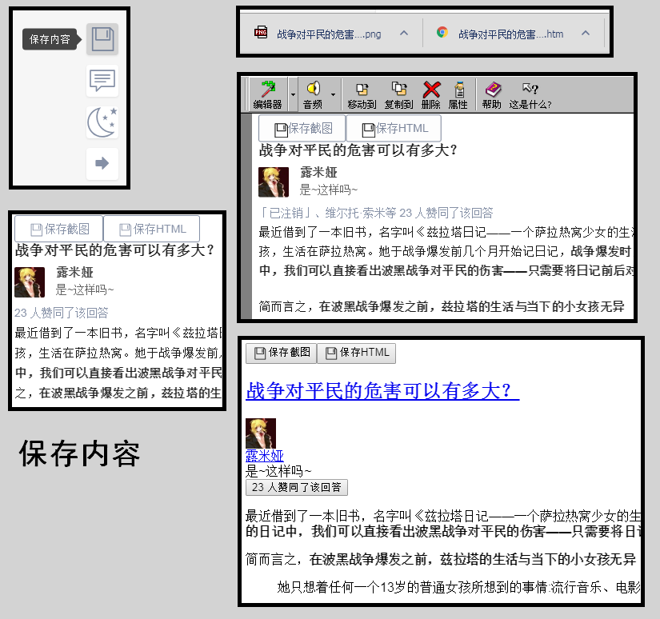

# rumia-zhihu-tools
PC 端「知乎」网站的辅助脚本~

使用 TamperMonkey 插件加载这个脚本~

由于我是在 windows 下写的，所以可能需要注意 CRLF 问题~

用中文作标识符是因为给变量函数起名实在是太难了……

功能：
- [x] 夜间模式
- [x] 首行缩进
- [x] 关注话题
- [x] 保存答案
- [x] 答案截图

代码风格：令人发指的~

代码水平：CSS 是什么、可以吃吗~
JavaScript 是什么、也许跟 Java 一样吧~

作者：[露米娅](https://www.zhihu.com/people/lu-mi-ya-56/)

SVG 来源：[SVG Icons](http://svgicons.sparkk.fr/)

# 使用效果
## 夜间模式

## 首行缩进

## 关注话题

## 保存内容

# 更新历史
## v0.34
- 修复了在用户页面（URL 以 www.zhihu.com/people/ 开始的页面）下无法查看关注列表的功能~
- README 中的英文词汇前后加入了空格

## v0.33
- 之前修复了文章页面的首行缩进功能，结果其它页面的首行缩进功能就坏掉了，被自己蠢哭……修复了其它页面的首行缩进功能

## v0.32
- 强制加载 lazy load 的图片，所以一些页面的图片也可以加载出来了并截图了……

## v0.31
- 截图功能也可以自动展开了，截出来的高度是正确的，但是图片内容可能加载不完全（可能是空白的图片），建议还是手动展开回答，等图片加载完成后再截图

## v0.30
- 新增了保存截图功能，但必须手动展开回答，否则图片加载未完成会导致高度不对

## v0.20
- 新增了保存答案功能（只能直接将一部分html保存……）
- 改进了代码中 jQuery 选择器的使用（不懂前端的后果……）

## v0.12
- 隐藏了文章页面下关注话题列表按钮（解决BUG的方式就是将问题的地方去掉……）
- 首次使用了版本号

## 更早
- 修复了文章页面下首行缩进功能不管用的 BUG
- 修复了文章页面下按钮会被遮挡的 BUG （这是知乎本身的BUG……）

